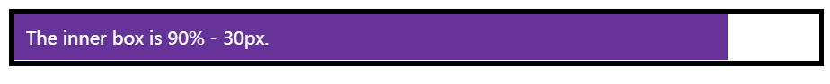
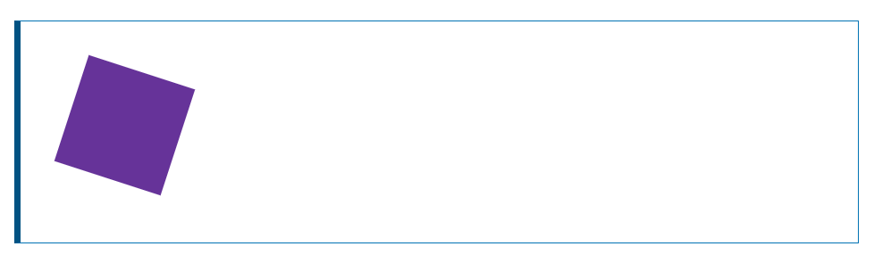

# CSS

## 函数

CSS中可以用一些简单的函数

```HTML
<div class="outer"><div class="box">The inner box is 90% - 30px.</div></div>
```

```CSS
.outer {
  border: 5px solid black;
}

.box {
  padding: 10px;
  width: calc(90% - 30px);
  background-color: rebeccapurple;
  color: white;
}
```

**如下所示：**



一个函数由函数名和一些括号组成，其中放置了该函数的允许值。在上面的calc()示例中，我要求此框的宽度为包含块宽度的90%，减去30像素。这不是我可以提前计算的东西，只是在CSS中输入值，因为我不知道90%会是什么。与所有值一样，MDN上的相关页面将有使用示例，这样您就可以看到函数是如何工作的。

另一个例子是[`<transform>`](https://developer.mozilla.org/zh-CN/docs/Web/CSS/transform), 例如 `rotate()`.

```html
<div class="box"></div>
```

```css
.box {
  margin: 30px;
  width: 100px;
  height: 100px;
  background-color: rebeccapurple;
  transform: rotate(0.8turn)
}
```

**如下所示：**



## @规则

到目前为止，我们还没有遇到 `@rules` (pronounced "at-rules"). 这是一些特殊的规则，为 CSS提供了一些关于如何表现的指导。 有些`@rules` 规则很简单，有规则名和值。例如，要将额外的样式表导入主CSS样式表，可以使用`@import`:

```css
@import 'styles2.css';
```

### @media 媒体查询

> 该规则用于获取你可视化终端的参数，比如长宽比例。`@media`是响应式设计的关键部分。

在下面的 CSS中，我们将给 `<body>` 元素一个粉红色的背景色。但是，我们随后使用@media创建样式表的一个部分，该部分仅适用于视口大于30em的浏览器。如果浏览器的宽度大于30em，则背景色将为蓝色。

```
body {
  background-color: pink;
}

@media (min-width: 30em) {
  body {
    background-color: blue;
  }
}
```

## 速记属性

一些属性，如 [`font`](https://developer.mozilla.org/zh-CN/docs/Web/CSS/font), [`background`](https://developer.mozilla.org/zh-CN/docs/Web/CSS/background), [`padding`](https://developer.mozilla.org/zh-CN/docs/Web/CSS/padding), [`border`](https://developer.mozilla.org/zh-CN/docs/Web/CSS/border), and [`margin`](https://developer.mozilla.org/zh-CN/docs/Web/CSS/margin) 等属性称为速记属性--这是因为它们允许您在一行中设置多个属性值，从而节省时间并使代码更整洁。

例如，这一行代码：

```
/* In 4-value shorthands like padding and margin, the values are applied
   in the order top, right, bottom, left (clockwise from the top). There are also other
   shorthand types, for example 2-value shorthands, which set padding/margin
   for top/bottom, then left/right */
padding: 10px 15px 15px 5px;
```

与这四行代码是等价的：

```
padding-top: 10px;
padding-right: 15px;
padding-bottom: 15px;
padding-left: 5px;
```

这一行：

```
background: red url(bg-graphic.png) 10px 10px repeat-x fixed;
```

与这五行代码是等价的：

```
background-color: red;
background-image: url(bg-graphic.png);
background-position: 10px 10px;
background-repeat: repeat-x;
background-attachment: fixed;
```

> **警告**：虽然速记经常允许您忽略值，但它们会将不包含的任何值重置为它们的初始值。这确保使用了一组合理的值。但是，如果您期望速记只更改传入的值，这可能会使您感到困惑。